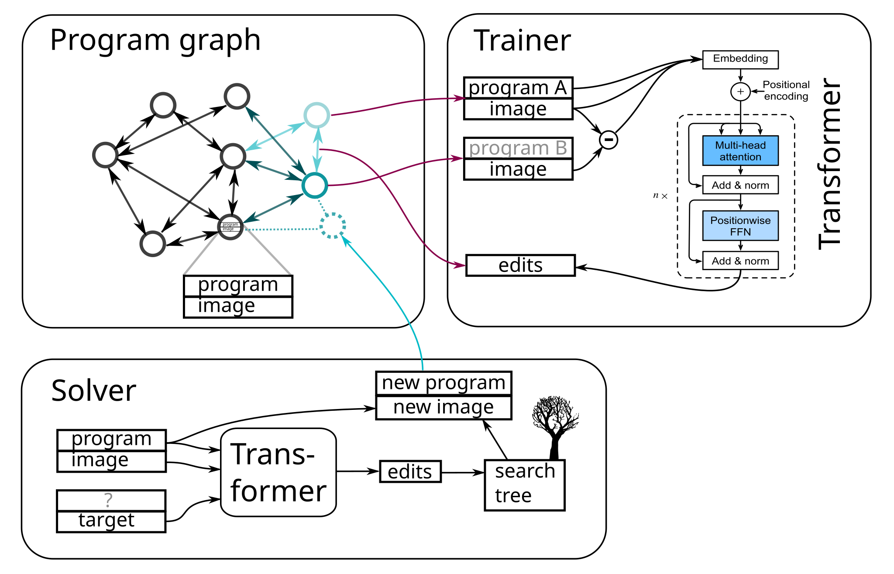

# About

This is a working repo of two ML projects:  
1. Dreamcoder-inspired bootstrapped program synthesis.  
2. Bio-inspired perceptual learning.

Most work in this repository is focused on (1).  
(2) Began during the pandemic & remains of high interest as a means of improving sample and training efficiency.   

## EC3: Bootstrapped program synthesis

*Hypothesis: Reasoning can emerge through directed search, memorization, and compression -- no human behavioral cloning required*

This is directly inspired by the excellent, insightful [DreamCoder paper](http://arxiv.org/abs/2006.08381)[^1].   DreamCoder is a program synthesis tool that aims to approximate the posterior -- the probability of a program given a specification -- based on a perceptual **network** and a **library**.  The perceptual network seeks to take the specification + working hypothesis context and output a new program token; the library seeks to encapsulate useful program primitives such that the search space is smaller.  Library building enables the perceptual network to do more with fewer tokens; perceptual network refinement enables greater search depths.

Here, our core modification is to replace the perceptual network (in DreamCoder a few-shot and relatively shallow prototypical network) with a complete vision transformer x token encoding transformer (presently a modified version of OpenAI's CLIP model).  
Rather than outputting complete programs, the model edits the working program -- same as a human -- aiming for it to better meet the specification.  The model is trained in a fully supervised way, based on edits to programs it's already seen (stochastically generated) or created itself, ala the UDRL paradigm.  Directionality is imbued into the model by selecting program paths through the graph of possible edits to maximize the match to a specification.  

The system, 'ec3' [^2] implements the perceptual network in Python & pytorch; the remaining functions (program graph, library building, supervised batch generation) are handled by Ocaml.  

Figure 1. 

<!--- regenerate png with: inkscape overview2.svg -w 2048 -o overview2.png --->
<!--- Github does not render the line end arrows properly --->

### Program graph 

Above, programs are stored in a graph database, in which nodes are (program,image) pairs (where the image is the result of running the program).  Nodes are connected through edges, which record the program edits required to move from one program to another. These edits are capped to a small length, for now.  The program database is randomly initialized based on sampling commands from the Logo DSL.  

### Trainer
During training edit-linked programs are sampled from the database.  These edits are presently selected from a minimum-spanning tree linking all programs, starting from the root (empty) node, and so constitute a progression of increasing complexity. 

Initial program and its image, and the new program and image are presented to the recognizer model - a modified transformer - which is trained via supervised learning, via the Adam optimizer, to sequentially produce the edits that convert program A to program B, with program B hidden but image B provided. 

### Solver

The solver takes the transformer trained above, and uses it to try to solve target problems.  For testing, this consists of the ol' standby: MNIST digits.  Edit probabilities are produced by the transformer, which are put into an search tree; these edits are enumerated based on descending probability. 

If the edits result in a working program (as triggered by an "done" edit token), and this program is closer to the target than the original, then the new program is added to the database and linked to existing nodes via edit edges. 

Nodes are thereby 'colored' based on proximity to targets.  Because memory is limited, these labels are used to cull the graph database to remove useless nodes. 

## Bio-inspired perceptual learning

*Hypothesis: Smart leverage of biological features and principles will improve the sample and compute efficiency of machine learning*

Motivation: 
* We & animals have much higher data efficiency: we learn from a few examples. 
    * Jascha Sohl-Dickstein said that, for large language models, it's on the order of __1e5 times__ less efficient. 
    * Human children learn at a rate of >10 words/day, sustained, and usually generalize immediately. 
* Roughly, people memorize first, and generalize second (or simultaneously); 
    * ML models generalize first (e.g. linear interpolation), and memorize later (e.g. transfomers or diffusion models memorizing their training data).  

How might it do this? 
* Biology has much richer structure (neuron subtypes, specific connectivity) and signals (neurotransmitters, signaling pathways, synaptic state) than machine learning models. 
    * These can be put to surprisingly effective use, eg. [Probabilistic skeletons endow brain-like neural networks with innate computing capabilities](http://biorxiv.org/lookup/doi/10.1101/2021.05.18.444689)
    * Synapses themselves can act like little state machines, as seen in the "eligibility traces" accessed by dopamine release.  
    * Synapses can also undergo very rapid changes, as is well demonstrated in the hippocampus, acting like free variables of association or binding (hypothetically solving the 'binding problem'). 
        * This is so much more than weights in an ML model, which look more like statistical integrators. 
    * Machine learning, in comparison, has a few types of neurons, and two or three types of signals: activations, "attention", and errors (backpropagated gradients). 
* Biology is much more *loopy*: rather than having one pass through a structure (MLP, transformer generating a token), higher-layer feedback onto lower layers tends to exceed bottom-up afferents, at least in the visual system. 
    * This also seems to be much more *flexible*: some images are recognized quickly; more ambiguous ones take longer, and some visual illusions can flip-flop between high-level "parses".  
* Information in the nervous system passes through a 'bottleneck', as Tony Zador is known for proposing, which increases robustness and generalization.  

All this makes sense, but after about 6 months of consistent experimentation (see bio-inspired folder), I managed to make something that would learn features from ~300 digits of MNIST.  Sample efficient, yes .. 

Yet each of the points in "How might it do this" is at least another degree of freedom which, when embedded in a complicated network of interaction, was difficult to reason about. The system itself was not *per se* arrived at via intuition or even the need to be small-network analyzable [^3], so realistically the only way to make solid progress was to run evolution directly.  See bio-inspired/skeleton.py

But it was clear that more intuition was needed, so I moved to Bootstrapped program synthesis, above. 

[^1]: DreamCoder itself is the result of decade+ of work, starting (roughly) with the Helmholtz machine, Explore-compress, DeepCoder, Learning to infer handwritten digits, etc.  Much of this work is out of the Tenenbaum lab. 
[^2]: [DreamCoder git repository](https://github.com/ellisk42/ec) was called ec2 -- though now it seems to be 'ec'
[^3]: That said, given: (1) As evolution arrives at systems that *can* be reasoned about, hence have finite interactomes (markov blankets), it's likely that the evolved brain is understandable, albeit likely in a high-dimensional statistical sense & at the right levels of abstraction and (2) Evolution, like human engineers, is faced with exploring infinite-dimensional spaces. To make efficient progress it has to subdivide, re-use, form hierarchies, modularize, limit interactions.  Small, understandable markov blankets are required. 